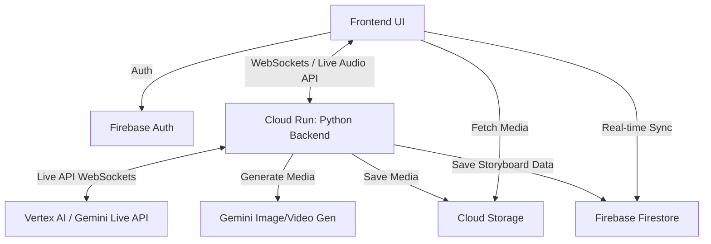

# Autism Event Storyboard Application Architecture

## Overview
A multimodal application designed to help parents of autistic children prepare for upcoming events by generating visual/audio storyboards. The app leverages Gemini 3's advanced multimodal capabilities (specifically the Gemini Live API for real-time audio/speech interaction, plus image/video generation) and is built entirely on Google Cloud serverless infrastructure.

## Tech Stack
* **Frontend**: React (Progressive Web App - PWA) - Provides excellent out-of-the-box support for the Web Audio APIs and WebSockets required by the Gemini Live API, matching Google's primary implementation examples. Packaged as a PWA, it will still offer a native-like mobile experience for parents during the event.
* **Backend**: Python (FastAPI) deployed on **Google Cloud Run** - Handles orchestration of AI calls, secure proxying for WebSockets, and business logic.
* **Database**: **Firebase Firestore** - Serverless NoSQL document database to store storyboard states, steps, and metadata. Allows real-time syncing across devices.
* **Storage**: **Google Cloud Storage** / Firebase Storage - Stores generated media (images, videos, audio clips).
* **Authentication**: **Firebase Authentication** - Manages user accounts (parents).
* **AI/ML**: **Google Vertex AI / Gemini Live API** - For real-time conversational processing of audio input via WebSockets, generating ideation steps, creating images/videos, and text-to-speech.

## Core Workflows

1. **Input & Ideation (Gemini Live API)**:
   * User engages in a real-time voice conversation describing the event (e.g., "We are going to Olive Garden tomorrow for lunch").
   * Frontend establishes a WebSocket connection with the Backend, which proxies a secure connection to the Gemini Live API (or connects directly if using secure client-side tokens).
   * User and Gemini 3 converse to brainstorm and extract key milestones interactively.
   * Gemini 3 generates a structured JSON response (via function calling or structured output) with the steps (Arrive, Host, Seat, Order, Eat, Pay, Leave) and suggested visual themes.

2. **Review & Customization**:
   * Frontend displays the steps and themes.
   * Parent edits steps (add/remove/modify), selects a theme, and approves the "sketch".

3. **Storyboard Generation**:
   * Backend receives the approved sketch.
   * Backend iterates through steps, calling Gemini 3 / Vertex AI Image Generation to create an image/video for each step based on the selected theme.
   * Backend generates optional audio narration (Text-to-Speech) for each step.
   * Media is saved to Cloud Storage.
   * Document is updated in Firestore with media URLs.

4. **Execution (The Event)**:
   * Firestore provides a unique ID for the storyboard, accessible via a permanent URL.
   * UI presents the storyboard in a "Step-Through" mode.
   * Child/Parent marks items as "Done" with a clear visual indicator. 

## Infrastructure Map


## Project Logistics
   * You have a CLI ticketing tool available to you called `tk`. `tk --help`` for instructions on how to use it to plan tasks, mark them in progress, update them and mark them done as needed.
   * The current directory 'devpost' is initialized with a python virtual environment via `uv`. Please always use this virtual environment or uv for executing, installilng any python libraries. 
   * There is a dedicated google cloud project for this named: prj-devpost-athon-adf
   * If you need to pick a google cloud region please use us-central1
   * The project does not have any services enabled, you can use gcloud commands to enable and deploy services as needed. 
   * When using firestore, please use the 'default' database to make use of the free tier provided by firestore. 
   * If you need to run docker locally, we are using the colima docker desktop workalike. Colima is already running and should accept native docker commands. 


## Google Cloud Setup
To ensure your Google Cloud project (`prj-devpost-athon-adf`) has all the necessary services enabled for the backend, Gemini generation, and future deployment, you can run the following `gcloud` commands:

### 1. Set your target project
Ensure your CLI is pointed to the correct project:
```bash
gcloud config set project prj-devpost-athon-adf
```

### 2. Enable the Required Google Cloud APIs
This single command will enable all the foundational APIs required by our architecture (Vertex AI, Cloud Run, Cloud Storage, Firestore, and Cloud Build):
```bash
gcloud services enable \
  aiplatform.googleapis.com \
  run.googleapis.com \
  cloudbuild.googleapis.com \
  storage.googleapis.com \
  firestore.googleapis.com \
  firebase.googleapis.com
```

### 3. Initialize the Firestore Database
If you haven't already created the default Firestore database for the project, you can initialize it with this command (you can change `--location` to your preferred region, like `us-east1` or `europe-west1`):
```bash
gcloud firestore databases create --location=us-central1 --type=firestore-native
```

Once these services are enabled, your local backend will have the correct permissions to interact with Vertex AI (Gemini/Imagen), Cloud Storage, and Firestore using your Application Default Credentials (`gcloud auth application-default login`).

## Running 


### 1. Start the Backend (FastAPI)
Since we are using `uv` for package management, you can start the backend by running the following commands in your first terminal:

```bash
cd backend

# Install dependencies into a virtual environment using uv
uv venv
source .venv/bin/activate
uv pip install -r requirements.txt

# Ensure you have your Google Cloud credentials set up
# You can authenticate via the gcloud CLI if you haven't already:
# gcloud auth application-default login
# gcloud config set project prj-devpost-athon-adf

# Alternatively, export your Gemini API key if using the developer API:
# export GEMINI_API_KEY="your-api-key"

# Start the server
uvicorn main:app --reload --port 8000
```
The backend will now be running at `http://localhost:8000`.

### 2. Start the Frontend (React / Vite)
In your second terminal window, run the following to start the React development server:

```bash
cd frontend

# Install the Node.js dependencies
npm install

# Start the Vite development server
npm run dev
```
The frontend should now be running at `http://localhost:5173`. 

Open `http://localhost:5173` in your browser. You should be greeted by the `LiveChat` UI where you can test the microphone and real-time voice connection to the Gemini Live API!