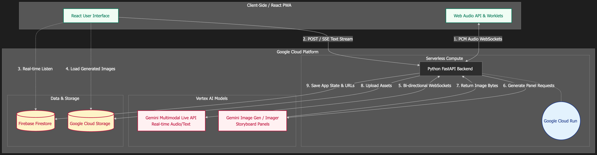
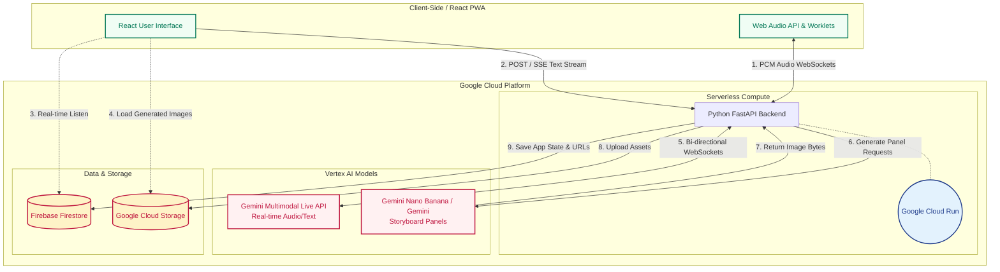

# Event Storyboarding Application Architecture

## Overview
A multimodal application designed to help parents with children on the austism spectrum prepare for upcoming events by generating visual storyboards. Storyboarding helps the child understand what is happening, the steps involved and allows everyone to anticipate challenges before they arise. 

The app leverages Gemini 3's advanced multimodal capabilities (specifically the Gemini Live API for real-time audio/speech interaction, plus image generation) and is built entirely on Google Cloud serverless infrastructure.

## Tech Stack
* **Frontend**: React (Progressive Web App - PWA) - Provides excellent out-of-the-box support for the Web Audio APIs and WebSockets required by the Gemini Live API, matching Google's primary implementation examples. Packaged as a PWA, it will still offer a native-like mobile experience for parents during the event.
* **Backend**: Python (FastAPI) deployed on **Google Cloud Run** - Handles orchestration of AI calls, secure proxying for WebSockets, and business logic. Cloud run hosts both the front and backend in separate services allowing for autoscaling, observability and production deployment patterns. 
* **Database**: **Firebase Firestore** - Serverless NoSQL document database to store storyboard states, steps, and metadata. Allows real-time syncing across devices.
* **Storage**: **Google Cloud Storage** / GCS Storage - Stores generated media for future reference using the permanent URL.
* **AI/ML**: **Google Vertex AI / Gemini Live API** - For real-time conversational processing of audio input via WebSockets, generating ideation steps, function calling and creating images. Uses the GenAI SDK against VertexAI for production-grade deployment, observability, scaling.

## Core Workflows
The workflow is designed to seamlessly weave text, images and audio together into an easy to use, productive, iterative session to produce helpful storyboards. 

1. **Input & Ideation (Gemini Live API)**:
   * User engages in a real-time voice conversation describing the event (e.g., "We are going to a restaurant tomorrow for lunch").
   * Frontend establishes a WebSocket connection with the Backend, which proxies a secure connection to the Gemini Live API (or connects directly if using secure client-side tokens).
   * User and Gemini 3 converse to brainstorm and extract key milestones interactively.
   * Gemini 3 generates a structured JSON response (via function calling or structured output) with the steps (Arrive, Host, Seat, Order, Eat, Pay, Leave) and suggested visual themes.

2. **Review & Customization**:
   * Frontend displays the steps and themes.
   * Parent interactively discusses edits to the steps with Gemini over voice, selects a theme, and approves the storyboard.

3. **Storyboard Generation**:
   * Backend receives the approved storyboard.
   * Backend iterates through steps, calling Gemini 3 / Vertex AI Image Generation to create a storyboard in the selected theme.
   * Gemini's thoughts during image generation are displayed via the front end as it works through the task.
   * Media is saved to Cloud Storage.
   * Document is updated in Firestore with media URLs.

4. **Execution (The Event)**:
   * Each storyboard is provided a unique ID for the storyboard, accessible via a permanent URL.
   * UI presents the storyboard in a "Step-Through" mode.
   * Child/Parent marks items as "Done" with a clear visual indicator. 

## Infrastructure Map
### Diagram: 

### Mermaid Chart

```mermaid
flowchart TB
    subgraph Frontend [Client-Side / React PWA]
        UI[React User Interface]
        WebAudio[Web Audio API & Worklets]
    end

    subgraph GCP [Google Cloud Platform]
        subgraph Compute [Serverless Compute]
            FastAPI[Python FastAPI Backend]
            CloudRun((Google Cloud Run))
            FastAPI -.- CloudRun
        end

        subgraph GenAI [Vertex AI Models]
            LiveAPI[Gemini Multimodal Live API<br/>Real-time Audio/Text]
            ImageModel[Gemini Nano Banana / Gemini<br/>Storyboard Panels]
        end

        subgraph Data [Data & Storage]
            Firestore[(Firebase Firestore)]
            Storage[(Google Cloud Storage)]
        end
    end

    %% Client Interactions
    WebAudio <-->|1. PCM Audio WebSockets| FastAPI
    UI -->|2. POST / SSE Text Stream| FastAPI
    UI -.->|3. Real-time Listen| Firestore
    UI -.->|4. Load Generated Images| Storage

    %% Backend Interactions
    FastAPI <-->|5. Bi-directional WebSockets| LiveAPI
    FastAPI -->|6. Generate Panel Requests| ImageModel
    ImageModel -->|7. Return Image Bytes| FastAPI
    FastAPI -->|8. Upload Assets| Storage
    FastAPI -->|9. Save App State & URLs| Firestore

    classDef gcp fill:#e3f2fd,stroke:#1e3a8a,stroke-width:2px,color:#1e3a8a;
    classDef frontend fill:#f0fdf4,stroke:#047857,stroke-width:2px,color:#047857;
    classDef ai fill:#fff1f2,stroke:#be123c,stroke-width:2px,color:#be123c;
    classDef db fill:#fef3c7,stroke:#be123c,stroke-width:2px,color:#be123c;
    
    class CloudRun gcp;
    class UI,WebAudio frontend;
    class LiveAPI,ImageModel ai;
    class Firestore,Storage db;
```

## Project Logistics for Agents
   * You have a CLI ticketing tool available to you called `tk`. `tk --help`` for instructions on how to use it to plan tasks, mark them in progress, update them and mark them done as needed.
   * The current directory 'devpost' is initialized with a python virtual environment via `uv`. Please always use this virtual environment or uv for executing, installilng any python libraries. 
   * There is a dedicated google cloud project for this named: prj-devpost-athon-adf
   * If you need to pick a google cloud region please use us-central1
   * The project does not have any services enabled, you can use gcloud commands to enable and deploy services as needed. 
   * When using firestore, please use the 'default' database to make use of the free tier provided by firestore. 
   * If you need to run docker locally, we are using the colima docker desktop workalike. Colima is already running and should accept native docker commands. 


## Automated CI/CD
This project features and automated build pipeline based on Google's cloud build system and it's native integrations to github. A push to the 'main' branch will trigger a build guided by custom cloudbuild.yaml files to either perform a terraform plan or apply as desired. 

### Terraform setup
This project follows the pattern established in https://github.com/jeffbryner/gcp-cloudrun-adkwebv2 but uses a single, pre-established GCP project meant to house the production instance for rapid iteration. 

To get started take the repo and bootstrap ourselves into a GCP cloudbuild pipeline.

- fork the repo, clone locally and operate in the main branch
- set the varables in the .tfvars files (use .tfvars.example as a guide)
- open a shell in cicd/prod
- render the backend.tf file inert (we don't have a bucket yet) by renaming to backend.tf.inert
- run ```terraform init``` to initialize terraform and providers.
- run ```terraform plan -target=module.gcp_project_setup``` to check the bootstrap build plan
- run ```terraform apply -target=module.gcp_project_setup``` to bootstrap the project and build pipeline

Note that terraform may not complete due to some chicken/egg problems.

Some services may not complete activiation: Solution: wait a bit to allow activation and retry
Authorization: If you do not have the google cloudbuild app for github installed, you'll need to follow steps below

## Authorization
You will need to authorize the google cloudbuild app to access your github repo. 
You can use a URL like this using your project name to allow access: 
https://console.cloud.google.com/cloud-build/triggers;region=global/connect?project=123456789

Clicking it will take you to GCP to complete the authorization. 

 


Before turning things over to the CICD pipeline, you will need to set the state bucket: 

Rename backend.tf.inert to backend.tf to enable state to be stored in the bucket created in the bootstrap step. 

Then re-init terraform to allow it to transfer state to GCS: 
From /cicd/dev and /cicd/prod (once you have dev working)
```
terraform init -force-copy -backend-config="bucket=<name of the bucket from terraform -output>"
```

Lastly, to avoid terraform vars ending up in a repo AND to allow our CICD pipeline to use the terraform state in the bucket we will add variables to the 'tfvars' google cloud secret. 

Create a text file with  the following variables:
(don't include the <> brackets, but do enclose in quotes) 

```
org_id          = "<your gcp org id number>"
billing_account = "<your billing account GUID>"
project_name    = "<your friendly name for the project>"
folder_id       = "<the integer number of the folder where youd like the project to live>"
github_org      = "<your githug org name>"
github_repo     = "<the github repo you want to use>"
bucket          = "<name of the bucket from terraform -output>"
```
In the GCP console for secret manager https://console.cloud.google.com/security/secret-manager
Upload this file as a new 'version' of the 'tfvars' secret. This will be used by cloudbuild at build time. 
Note: Technically the bucket isn't a real terraform variable, but we store it here harmlessly as a way to avoid having to store extra secrets just for another variable. 

Triggers for cloudbuild can be created directly in the cloudbuild console allowing you to choose whether you'd like the triggers to run automatically, manually or with approval. Reference the /prod/cloudbuild.yaml file for a trigger to run ```terraform plan``` and reference the cloudbuild-apply.yaml file for ```terraform apply```


## Manual Google Cloud Setup
To ensure your Google Cloud project has all the necessary services enabled for the backend, Gemini generation, and future deployment, you can run the following `gcloud` commands:

### 1. Set your target project
Ensure your CLI is pointed to the correct project:
```bash
gcloud config set project prj-project-name
```

### 2. Enable the Required Google Cloud APIs
This single command will enable all the foundational APIs required by our architecture (Vertex AI, Cloud Run, Cloud Storage, Firestore, and Cloud Build):
```bash
gcloud services enable \
  aiplatform.googleapis.com \
  run.googleapis.com \
  cloudbuild.googleapis.com \
  storage.googleapis.com \
  firestore.googleapis.com \
  firebase.googleapis.com
```

### 3. Initialize the Firestore Database
If you haven't already created the default Firestore database for the project, you can initialize it with this command (you can change `--location` to your preferred region, like `us-east1` or `europe-west1`):
```bash
gcloud firestore databases create --location=us-central1 --type=firestore-native
```

Once these services are enabled, ensure you have project owner permissions and your local backend will have the correct permissions to interact with Vertex AI (Gemini/Imagen), Cloud Storage, and Firestore using your Application Default Credentials (`gcloud auth application-default login`).

## Running 


### 1. Start the Backend (FastAPI)
Since we are using `uv` for package management, you can start the backend by running the following commands in your first terminal:

```bash
cd backend

# Install dependencies into a virtual environment using uv
uv venv
source .venv/bin/activate
uv pip install -r requirements.txt

# Ensure you have your Google Cloud credentials set up
# You can authenticate via the gcloud CLI if you haven't already:
# gcloud auth application-default login
# gcloud config set project prj-devpost-athon-adf

# Alternatively, export your Gemini API key if using the developer API:
# export GEMINI_API_KEY="your-api-key"

# Start the server
uvicorn main:app --reload --port 8000
```
The backend will now be running at `http://localhost:8000`.

### 2. Start the Frontend (React / Vite)
In your second terminal window, run the following to start the React development server:

```bash
cd frontend

# Install the Node.js dependencies
npm install

# Start the Vite development server
npm run dev
```
The frontend should now be running at `http://localhost:5173`. 

Open `http://localhost:5173` in your browser. You should be greeted by the `LiveChat` UI where you can test the microphone and real-time voice connection to the Gemini Live API!